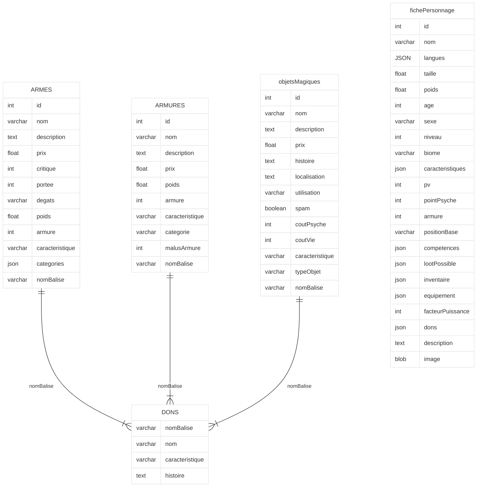

# Aventure-Cie

Tâches a réaliser
- [x] : Créer et mettre en place la base de données
- [ ]     1 - Fiche perso ( Fait appel à des items des autres tables
- [x]     2 - Dons
- [x]     3 - Armes
- [x]     4 - Armures
- [x]     5 - Objet Magiques
- [ ] : Mettre en place une recherche de fiche de personnage dans la base de données :
- [ ]     1 - par ordre alphabétique
- [ ]     2 - par catégories
- [ ]     3 - Par nom
- [ ] : Mise en place de l'annuaire
- [ ]     1 - Affichage des élements de chaques catégories
- [ ]     3 - Ajout de le posibilité de clicker sur un élement pour voir plus de détails
- [ ]     2 - Possibilité d'ajouter des élements à chaques catégories
- [ ] : Mise en place de la création de personnage
- [ ]     1 - Formulaire pour créer le personnage
- [ ]     2 - Export des caractéristiques en format PDF
- [ ] : Mise en place de la création des PNJ Aléatoires

Choix des technologies : 
  - BDD : Mysql
  - FRONT : Svelte
  - BACK : FastAPI + Svelte kit
 
Docker puis Google Cloud

Diagramme de la base de donnée

